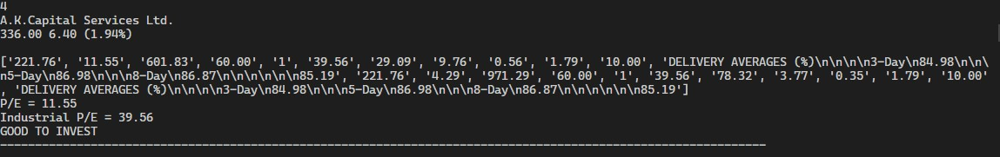

# Stock-investor-on-P/E

This is python automation using beautifulsoup4 to find the stocks good to invest 
The webscraping is on the website [moneycontrol](https://www.moneycontrol.com/)
which collects data of the listed stocks and compare P/E(Profit per earning) and its Industrial P/E of each stock 
then it categorise the stock based on which have lesser p/e than the industrial p/e as Good to invest rest not recommended
and finally update the data into the Invest_in_this_stocks.txt

## Screenshots ##

This is just a simple project based on beautifulsoup4 which can be modified with more paramaters like (ROE, ROA, β)
